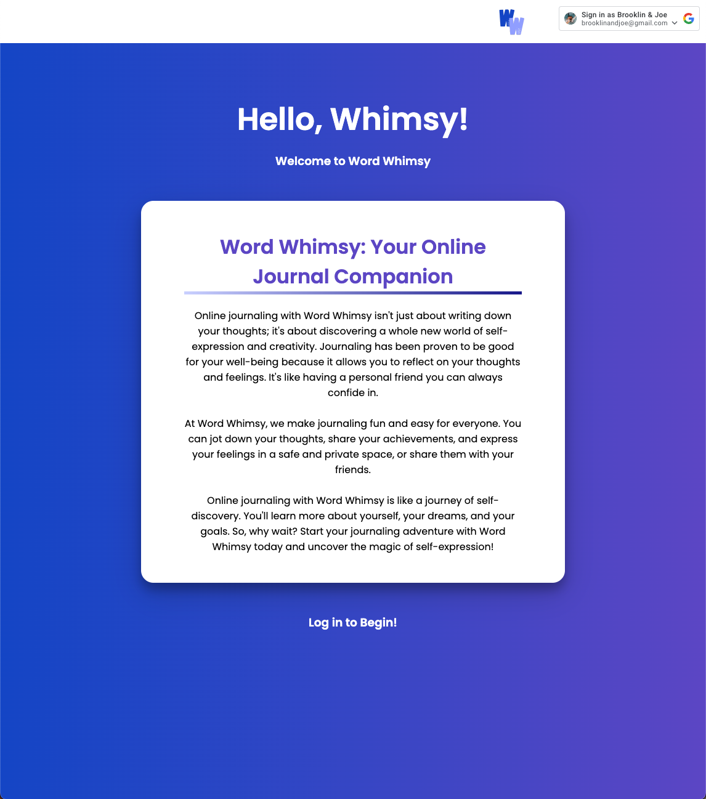
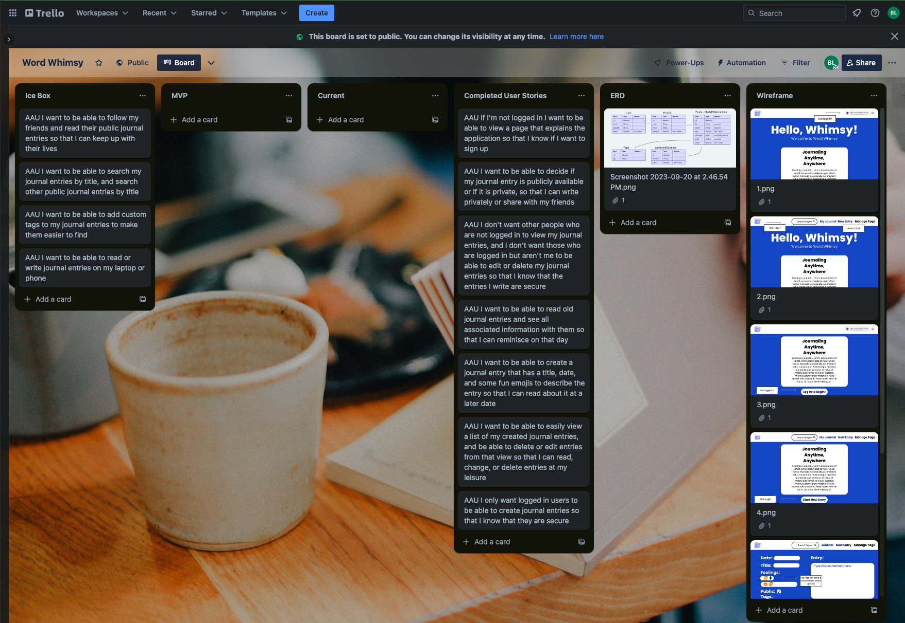

# Word Whimsy - Online Journaling

### Uncover the magic of self-expression with Word Whimsy, your online journal companion!

Online journaling with Word Whimsy isn't just about writing down your thoughts; it's about discovering a whole new world of self-expression and creativity. With Word Whimsy, we make journaling fun and easy for everyone. You can jot down your thoughts, share your achievements, and express your feelings in a safe and private space, or share them with your friends.

## [Click Here](https://word-whimsy.fly.dev/) to visit Word Whimsy!

### Key Application Features ✏️
- **Google O-Authentication:** Sign in securely using your Google account to access the application.

- **Create Posts:** Craft your Whimsy entries with the option to set them as either public (viewable by other Word Whimsy users) or private (visible to you only).

- **Customize Visibility:** Easily adjust the visibility of your posts and associated content whenever you like.

- **Explore Other Whimsies:** Discover and explore Whimsy pages from other users, and access their posts if they've made them public.

- **Engage Through Comments:** Share your thoughts and engage with the Word Whimsy community by commenting on publicly visible posts.

- **Manage Your Comments:** Maintain control over your contributions by editing or deleting comments you've authored on other users' posts.

- **Moderate Comments:** Administer your publicly posted Whimsy entries by removing comments made by others.

### Skills & Technologies Used ⚙️
- **Full-stack development** 
- **Full CRUD functionality** 
- **Trello project planning** 
- **ERD design** 
- **User stories** 
- **Data entity management** 
- **CSS Flexbox** 
- **Node.js** 
- **Passport.js**
- **Mongoose** 
- **MongoDB** 
- **Express.js** 
- **JavaScript** 
- **CSS styling** 
- **Git version control** 

#### View the full Trello Board used for Project Planning [here](https://trello.com/b/VKRw8Ujj/word-whimsy)

## Credits 🥳
- **Trello** for project planning
- **Whimsical** for ERD creation
- **Canva** for wireframing

## Ice Box 🧊
 - [ ] Add in responsive design to make the application easy to view and use on multiple screen sizes
 - [ ] Add search capability in the profiles view to be able to find others easier
  - [ ] Create "following" functionality to be able to follow your friends and view their Whimsy posts easier
  - [ ] Create tag functionality to add tags to your post, then be able to search through Whimsy posts based on those tags